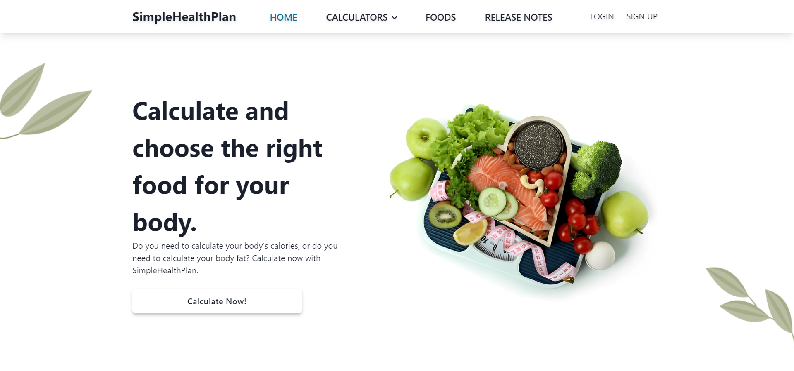

# eFitness Meal Plan

eFitness Meal Plan is a web application built with Next.js, TypeScript, Tailwind CSS, and Firebase. The purpose of this project is to provide users with a comprehensive platform to calculate calories, body fat, and find foods with nutritional value and composition. It aims to assist individuals in managing their diet and achieving their fitness goals.

## Features

- **Calorie Calculation**: The application allows users to calculate their daily calorie intake based on their personal information, activity level, and fitness goals.

- **Body Fat Calculation**: Users can input their body measurements to calculate their body fat percentage, providing valuable insights into their overall fitness progress.

- **Nutritional Value**: eFitness Meal Plan offers a vast database of foods, including detailed nutritional information such as calories, macronutrients, vitamins, and minerals. Users can search for specific foods or browse through various categories.

- **Meal Planning**: The application provides a meal planning feature, allowing users to create personalized meal plans based on their dietary preferences and nutritional goals. Users can select foods from the database and organize them into meals and snacks throughout the day.

- **Shopping List**: eFitness Meal Plan generates a convenient shopping list based on the selected meal plan, making it easy for users to purchase the necessary ingredients for their meals.

## Technologies Used

- **Next.js**: A React framework that enables server-side rendering and provides a robust development environment for building modern web applications.

- **TypeScript**: A statically typed superset of JavaScript that enhances code quality, readability, and maintainability.

- **Tailwind CSS**: A utility-first CSS framework that enables rapid UI development by providing a wide range of pre-built components and styling options.

- **Firebase**: A comprehensive development platform that offers various tools and services, including hosting, database management, and user authentication. Firebase will be utilized for storing user information, meal plans, and food data.

## Installation

1. Clone the repository: `git clone https://github.com/your-username/efitness-meal-plan.git`
2. Install dependencies: `npm install`
3. Set up a Firebase project and configure the necessary credentials.
4. Update the Firebase configuration in the project.
5. Start the development server: `npm run dev`
6. Open the web application in your browser: `http://localhost:3000`

## Contributing

Contributions are welcome! If you encounter any issues or have suggestions for improvements, please open an issue or submit a pull request. Make sure to follow the project's code of conduct.

## License

This project is licensed under the [MIT License](LICENSE.md).

## Acknowledgments

- [Next.js Documentation](https://nextjs.org/docs) for providing comprehensive guidance on building Next.js applications.
- [Tailwind CSS Documentation](https://tailwindcss.com/docs) for the extensive documentation and examples of Tailwind CSS utilities and components.
- [Firebase Documentation](https://firebase.google.com/docs) for the detailed documentation on using Firebase services.
- The open-source community for the numerous libraries, tools, and resources that have been instrumental in the development of this project.
